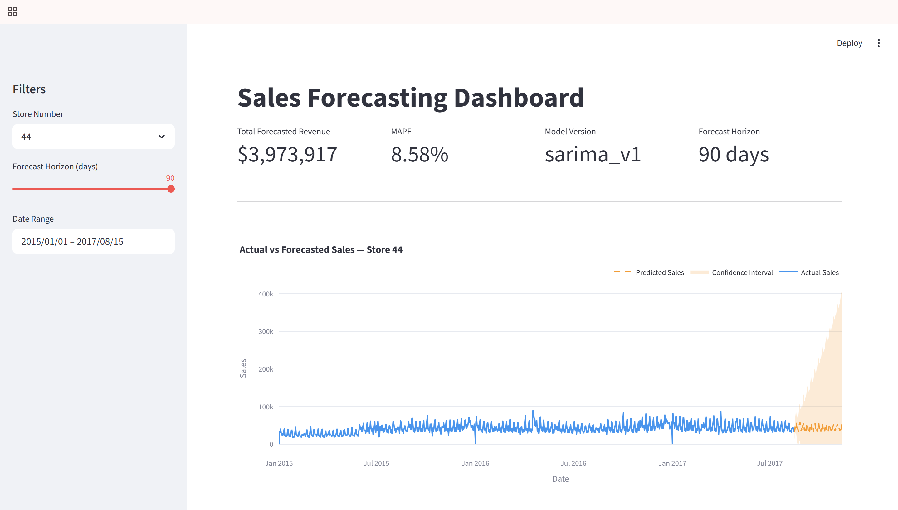
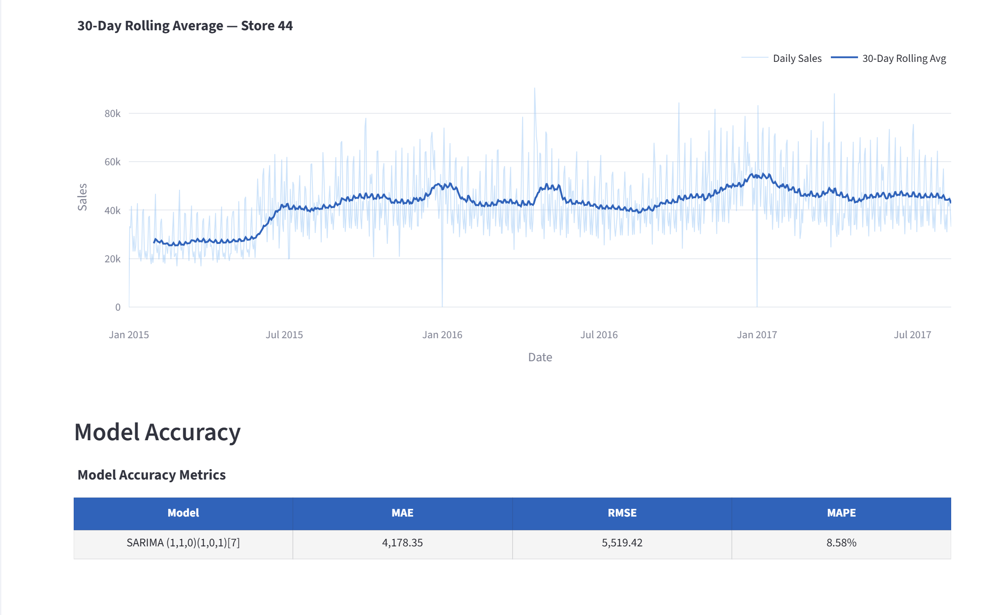
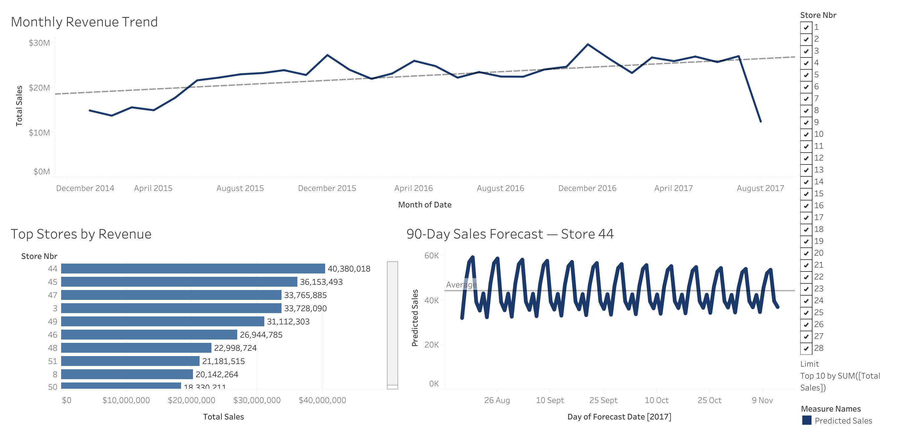

markdown# 📊 Sales Forecasting with SQL, Time Series & Tableau


> End-to-end sales forecasting pipeline built on 1.7M+ real retail transactions — from raw data ingestion to interactive dashboards.

---

## 🧠 What This Project Does — In Simple Terms

Imagine you are the head of data analytics at a large grocery chain with **54 stores across Ecuador**. Every day, each store sells hundreds of products — and you need to answer questions like:

- **Which stores are generating the most revenue?**
- **How are sales trending over time?**
- **What will sales look like over the next 90 days?**

This project builds a complete system that answers all of those questions automatically.

### Here is exactly what happens, step by step:

**Step 1 — Data Collection**
1.7 million rows of real daily sales records are loaded from CSV files into a PostgreSQL database. Think of this as setting up a clean, organized warehouse for all the raw data.

**Step 2 — Data Cleaning & Transformation**
Using advanced SQL, the raw data is validated (checking for missing values, duplicates, errors) and transformed into clean analytical tables — like a summary sheet that's ready for analysis.

**Step 3 — Statistical Analysis**
Using R, the sales data is examined for patterns — weekly cycles, seasonal trends, and year-over-year growth — to understand what drives sales before building any model.

**Step 4 — Forecasting**
A SARIMA machine learning model is trained on historical sales data for each of the 51 stores. It learns the patterns and predicts the next 90 days of sales — with a proven accuracy of 8.58% error rate, which is 55% more accurate than simple baseline methods.

**Step 5 — Interactive Dashboards**
The forecasts and insights are presented in two interactive tools — a Tableau dashboard for executive reporting and a Streamlit web app where anyone can select a store and explore its sales forecast visually.

---

## 🔴 Live Demo

| Tool | Link |
|---|---|
| 📊 Tableau Dashboard | [View Live Dashboard](https://public.tableau.com/app/profile/adarsh.kalakonda/viz/SalesForecastingAnalyticsDashboard/SalesForecastingAnalyticsDashboard) |
| 🚀 Streamlit App | *(Coming soon — deployment in progress)* |

---

## 🎯 Project Overview

This project simulates a real-world retail analytics pipeline for **Corporación Favorita**, Ecuador's largest grocery retailer. It covers every stage of a production data workflow:

- **Ingestion** — Loading 1.7M+ records from raw CSV into PostgreSQL
- **Transformation** — Advanced SQL to build analytical mart tables
- **Validation** — 5 automated data quality checks
- **Modelling** — SARIMA time series forecasting for 51 stores
- **Visualisation** — Interactive Tableau dashboard + Streamlit app

---

## 📈 Key Results

| Metric | Value |
|---|---|
| Records processed | 1,703,592 |
| Stores forecasted | 51 out of 54 |
| Best model | SARIMA(1,1,0)(1,0,1)[7] |
| Model MAPE | **8.58%** |
| Baseline MAPE | 19.30% (Naive) |
| Improvement | **55% over best baseline** |
| Forecast horizon | 90 days with confidence intervals |

---

## 🏗️ Architecture

```text
Kaggle CSV (1.7M rows)
        │
        ▼
  ┌─────────────┐
  │  ingest.py  │  Python + psycopg2 bulk load
  └──────┬──────┘
         │
        ▼
  ┌──────────────────────────────┐
  │   PostgreSQL — raw schema    │
  │  raw.sales  raw.stores       │
  │  raw.oil    raw.holidays     │
  └──────┬───────────────────────┘
         │
        ▼
  ┌──────────────────────────────┐
  │   SQL Transforms (7 files)   │
  │  CTEs · window fns · views   │
  └──────┬───────────────────────┘
         │
        ▼
  ┌──────────────────────────────┐
  │   PostgreSQL — mart schema   │
  │  mart.daily_sales            │
  │  mart.store_performance      │
  │  mart.forecasts (4,590 rows) │
  └──────┬───────────────────────┘
         │
    ┌────┴────┐
    ▼         ▼
 ┌─────┐  ┌──────────────┐
 │  R  │  │ Python SARIMA│
 │ EDA │  │  51 stores   │
 └─────┘  └──────┬───────┘
                 │
         ┌───────┴───────┐
         ▼               ▼
   ┌──────────┐   ┌─────────────┐
   │  Tableau │   │  Streamlit  │
   │Dashboard │   │     App     │
   └──────────┘   └─────────────┘
```

---

## 🛠️ Tech Stack

| Layer | Technology | Purpose |
|---|---|---|
| Database | PostgreSQL 16 | Data warehouse |
| ETL | Python, pandas, psycopg2 | Data ingestion & loading |
| SQL | Window functions, CTEs, subqueries | Data transformation |
| Statistical Analysis | R, tseries, forecast | EDA, ADF test, ACF/PACF |
| Forecasting | Python, pmdarima, statsmodels | SARIMA modelling |
| Dashboard | Tableau Public | Executive reporting |
| App | Streamlit, Plotly | Interactive forecasting |
| Version Control | Git, GitHub | Source control |

---

## 📁 Project Structure

| Folder | File | Purpose |
|---|---|---|
| `sql/` | `01_schema.sql` | Table definitions for raw and mart schemas |
| `sql/` | `03_data_quality.sql` | 5 automated data validation checks |
| `sql/` | `04_window_functions.sql` | Rolling averages, rankings, MoM growth |
| `sql/` | `05_ctes_subqueries.sql` | CTEs, subqueries, best/worst day analysis |
| `sql/` | `06_mart_build.sql` | Mart table population |
| `etl/` | `config.py` | Database connection helper |
| `etl/` | `ingest.py` | CSV to PostgreSQL bulk loader |
| `models/` | `baseline.py` | Naive, MA, and seasonal naive baselines |
| `models/` | `arima_model.py` | SARIMA forecasting for all 54 stores |
| `models/` | `write_forecasts.py` | Writes forecasts to PostgreSQL |
| `app/` | `streamlit_app.py` | Main interactive dashboard |
| `app/` | `db.py` | SQLAlchemy connection |
| `app/` | `charts.py` | Plotly chart functions |
| `reports/` | `model_accuracy.md` | SARIMA vs baseline comparison |
| `tableau/` | `tableau_public_link.txt` | Live Tableau Public URL |
| *(root)* | `.env.example` | Credentials template |
| *(root)* | `requirements.txt` | Python dependencies |

---

## 📸 Screenshots

### Streamlit Dashboard




### Tableau Dashboard


## ⚙️ Setup Instructions

### Prerequisites
- Python 3.11+
- PostgreSQL 16
- Git

### 1. Clone the repository
```bash
git clone https://github.com/AdarshKalakonda/SalesForecasting.git
cd SalesForecasting
```

### 2. Create virtual environment
```bash
python -m venv venv
venv\Scripts\activate        # Windows
source venv/bin/activate     # Mac/Linux
```

### 3. Install dependencies
```bash
pip install -r requirements.txt
```

### 4. Configure environment
```bash
cp .env.example .env
# Open .env and add your PostgreSQL credentials
```

### 5. Set up PostgreSQL database
```bash
psql -U postgres -c "CREATE DATABASE sales_forecast;"
psql -U postgres -d sales_forecast -c "CREATE SCHEMA raw; CREATE SCHEMA mart;"
psql -U postgres -d sales_forecast -f sql/01_schema.sql
```

### 6. Download dataset
Download from [Kaggle Store Sales Competition](https://www.kaggle.com/competitions/store-sales-time-series-forecasting/data) and place CSVs in:
data/raw/store-sales-time-series-forecasting/

### 7. Run the full pipeline
```bash
# Load data
python etl/ingest.py

# Build mart tables
psql -U postgres -d sales_forecast -f sql/06_mart_build.sql

# Run forecasting models
python models/arima_model.py

# Launch dashboard
streamlit run app/streamlit_app.py
```

---

## 📊 Model Accuracy Report

| Model | MAPE | Result |
|---|---|---|
| Naive (last value) | 19.30% | Baseline |
| Moving Average 28-day | 14.74% | Baseline |
| Seasonal Naive | 19.89% | Baseline |
| **SARIMA(1,1,0)(1,0,1)[7]** | **8.58%** | ✅ Best |

**55% improvement over best baseline (Naive at 19.30%)**

The model uses weekly seasonality (m=7) discovered through ACF/PACF analysis in R, with parameters selected via auto_arima AIC minimisation across 41 candidate models.

---

## 🗄️ SQL Highlights

**Window Functions** — Rolling averages and store rankings:
```sql
AVG(sales) OVER (
    PARTITION BY store_nbr, family
    ORDER BY date
    ROWS BETWEEN 6 PRECEDING AND CURRENT ROW
) AS rolling_7d_avg
```

**CTEs** — Top product families per store per year:
```sql
WITH yearly_family_sales AS (
    SELECT store_nbr, family,
           EXTRACT(YEAR FROM date) AS year,
           SUM(sales) AS total_sales
    FROM raw.sales
    GROUP BY store_nbr, family, EXTRACT(YEAR FROM date)
)
SELECT * FROM yearly_family_sales
WHERE RANK() OVER (
    PARTITION BY store_nbr, year
    ORDER BY total_sales DESC
) <= 5
```

---

## 📜 Dataset

[Corporación Favorita Grocery Sales Forecasting](https://www.kaggle.com/competitions/store-sales-time-series-forecasting) — Real Ecuador supermarket data covering 54 stores, 33 product families, 2013–2017.

---

## 👤 Author

**Adarsh Kalakonda**  
[GitHub](https://github.com/AdarshKalakonda) · [LinkedIn](#)